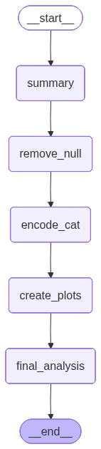

# 📊 Data Analyst Agent

A LangGraph-based AI Workflow that acts as an autonomous data analyst.
It reads a CSV, performs profiling, cleaning, feature encoding, visualization, and generates a complete analysis report along with saved plots.

## 🚀 Features

📝 CSV Upload & Summary
Automatically reads and summarizes structure, data types, missing values, and statistics.

🔍 Data Cleaning & Encoding
Handles missing values and encodes categorical variables to prepare for analysis.

📈 Automated Visualization
Generates plots saved to downloaded_plots/ — includes histograms, correlations, bar charts, etc.

🤖 LLM-Driven Workflow
All steps are orchestrated by a LangGraph workflow, leveraging Python execution for deep analysis.

📦 Streamlit Frontend
Friendly UI to upload CSV, run workflow, and display both analysis text and generated charts.

📄 Markdown Report Output
Final analysis is rendered as formatted markdown for readability and export.

## 📁 Repository Structure
```
Data-Analyst-Agent/
├── analyst_Agent.py          # LangGraph workflow & agent logic
├── frontend.py               # Streamlit UI integration
├── requirements.txt          # Python dependencies
├── hair_eye_color_CSV.csv    # Sample dataset
├── output.md                 # Example analysis output
├── downloaded_plots/         # Folder for generated images
├── temp/                     # Temporary CSV upload storage
└── testing.ipynb             # Notebook for testing
```
## 🛠 Installation

1. Clone the repository
```
git clone https://github.com/PrasannaMadiwar/Data-Analyst-Agent.git
cd Data-Analyst-Agent
```
2. Create a virtual environment & install dependencies

```pip install -r requirements.txt```

3. Configure API Keys

If your workflow uses external services (Daytona, LLM APIs), set your environment variables:

```
export DAYTONA_API_KEY="your_key_here"
export GROQ_API_KEY="your_key_here"
```
4. Run the Streamlit app
```
streamlit run frontend.py
```

## 📌 How it Works

Upload CSV file using the Streamlit interface.

The frontend calls the workflow:

Uploads CSV to your sandbox (Daytona/Agents)

Summarizes dataset

Cleans nulls & encodes categories

Creates explanatory plots

Produces final analysis text

Results Display

Markdown summary of the dataset & insights

Rendered plot images from downloaded_plots/

## 🔄 Workflow Graph

The Data Analyst Agent is built using a structured LangGraph workflow pipeline:


